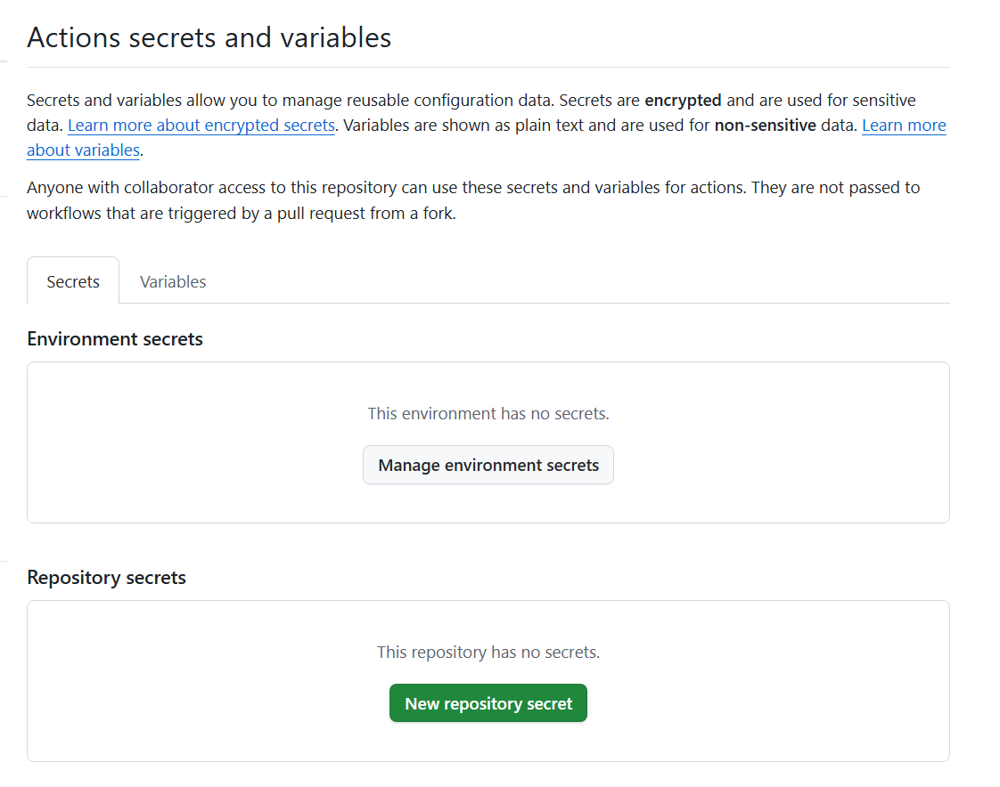

# AWS-Infra-03-RDSCacheMQBeanstalkInfra

# Application Overview

🔹 Frontend & Network Entry
- CloudFront: Acts as a CDN (Content Delivery Network) to cache and distribute content globally, reducing latency and improving performance for users.
- Application Load Balancer (ALB): Distributes incoming HTTP/HTTPS traffic across multiple instances in the Auto Scaling Group to ensure high availability and fault tolerance.
- Internet Gateway: Allows communication between instances in the public subnet and the internet.

🔹 Networking & Routing
- VPC (Virtual Private Cloud): Isolates and controls network settings for all resources, enhancing security.
- Public Subnets: Host internet-facing resources like the ALB and NAT Gateway.
- Private Subnets: Host backend services like application servers, databases, MQ, and caching, not directly exposed to the internet.
- Route Tables: Manage routing between subnets, S3, and the internet.
- NAT Gateway: Allows instances in the private subnet to access the internet (e.g., to download updates) without exposing them directly.
- S3 Gateway Endpoint: Enables private network access to Amazon S3 without using the Internet Gateway, improving security and reducing data transfer costs.

🔹 Compute Layer
- Auto Scaling Group (ASG): Automatically adds/removes EC2 instances based on demand, ensuring scalability and high availability of the application layer.

🔹 Application Integration
- Amazon MQ: Managed message broker (e.g., ActiveMQ or RabbitMQ) used to decouple application components and manage asynchronous communication.

- Memcached (Amazon ElastiCache): Provides in-memory data caching to reduce database load and increase application performance.

🔹 Data Storage
- Amazon RDS: Managed relational database service used to store application data (e.g., MySQL, PostgreSQL, etc.) with high availability and automated backups.

- Amazon S3: Object storage for storing static assets, backups, deployment artifacts, logs, and other large files.

🔹 Monitoring & Alerting
- Amazon CloudWatch: Monitors logs, metrics, and events; used to trigger alarms based on defined thresholds.
- CloudWatch Alarms: Watch specific metrics and trigger actions (e.g., scale out or send notifications).
- SNS Topic (Simple Notification Service): Sends alerts via email, SMS, or other protocols when an alarm is triggered (e.g., CPU usage exceeds threshold).

🔹 Security
- Security Groups: Acts as virtual firewalls for controlling inbound/outbound traffic for EC2, ALB, Amazon MQ, and RDS.

# Implement Plan

## Step 1: Automate IaC with Terraform

## Setup Terraform Environment with diffent stage and S3 backend storage

- You need to have own AWS account and billing enable
- Create IAM user with name `AWS-Infra-03-IAM-User` and grant role below
    - AmazonS3FullAccess
    - AmazonDynamoDBFullAccess
    - AmazonVPCFullAccess
    - AmazonEC2FullAccess
    - SecretsManagerReadWrite
    - AmazonRDSFullAccess
    - IAMFullAccess
    - AdministratorAccess-AWSElasticBeanstalk
    - AWSCertificateManagerFullAccess

- Go to AWS Console and create new Bucket Name `aws-infra-03-terraform-state`

- Next step, you need to create `Access Key` for this user, so we can use it for auth with Github Action
    - Access key: ``
    - Secret access key: ``

- You need to create secret environment in Github, choose `New repository secret`
    - AWS_ACCESS_KEY_ID
    - AWS_SECRET_ACCESS_KEY

    

- In this project, I setup Terraform with 2 env: dev, prod, and you need to update correct file `.github/workflows/terraform.yml` with two mode: `create` and `destroy`

### Setup VPC module

- VPC name `aws-infra-03-vpc`
- Private Subnet: [ "10.0.10.0/24", "10.0.20.0/24" ]  `aws-infra-03-private-subnet-1` `aws-infra-03-private-subnet-2`
- Public Subnet: [ "10.0.1.0/24", "10.0.2.0/24" ]  `aws-infra-03-public-subnet-1` `aws-infra-03-public-subnet-2`
- cidr_block = "10.0.0.0/16"
- availability_zones = [ "ap-southeast-1a", "ap-southeast-1c" ]
- region = "ap-southeast-1"
- Enable VPC endpoint for S3 gateway

### Setup Security Group and KeyPair

- Public-sg (Allow internet port 80/443) `aws-infra-03-public-sg`
- Private-sg (Allow from public-sg) `aws-infra-03-private-sg`
- bastion-sg (Allow ssh from my public IP) `aws-infra-03-bastion-sg`
- database-sg (Allow all port from Private-sg, bastion-sg, Also allow internal port in in Database Security group) `aws-infra-03-database-sg`

### Setup RDS database module

- Create RDS database
- Create DB subnet group `aws-infra-03-rds-sub-grp`
- Add availability zone ["ap-southeast-1a", "ap-southeast-1c"]
- Add RDS to Subnets `aws-infra-03-private-subnet-1`
- Create parameter group with name `aws-infra-03-para-grp`
- Create database -> Standard Database -> MySQL -> Engine Version `8.0.41` -> Template `Free Tier` -> Choose `Single DB instance`
- Give a name `aws-infra-03-rds-mysql-db`
- Master username `admin`
- Store Password in AWS Secret Manager in security module with password `strong_password`
- In instance configuration `Burstable classes` and choose  `db.t3.micro`
- Storge type `gp2`
- Allocated Storage `20GiB`
- Choose Don't connect to an EC2 compute
- Network type IPv4m choose this `aws-infra-03-vpc` and assign for DB subnet group `aws-infra-03-rds-sub-grp`
- Choose exsiting Security Group `aws-infra-03-database-sg`
- Choose Database port `3306`
- Database authentication `Password authentication`
- Choose `General log`

### Setup Elastice Cache

- Create subnet group `aws-infra-03-elasticecache-sub-grp` and attach to `aws-infra-03-vpc`
- Create parameter group with name `aws-infra-03-elasticecache-para-grp`
- Choose family `memcached1.6`
- Create Memcached Cluster -> Choose Deployment option `Design your own cache` 
- Creation method `Cluster cache` and Location `AWS Cloud`
- And give a name `aws-infra-03-elasticecache-svc`
- Choose Engine version `1.6.17` and port `11211`
- Choose and assign for `aws-infra-03-elasticecache-para-grp`
- Choose Node type `cache.t2.micro`
- Choose number of nodes : `1`
- Choose existing subnet group `aws-infra-03-elasticecache-sub-grp`
- Choose exsiting Security Group `aws-infra-03-database-sg`
- No preference for maintenance window
- Add tag `project : AWS-Infra-03-RDSCacheMQBeanstalkInfra`

### Setup Amazon MQ

- Create broker engine `RabbitMQ` and choose deployment mode `Single-instance broker`
- Set broker name `aws-infra-03-rmq` and choose broker instance type `mq.t3.micro`
- Set user name `rabbit`
- Store Password in AWS Secret Manager in security module with password `strong_password`
- Choose Broker enginer version `3.10.20`
- Also enable CloudWatch Logs for this
- Choose Network Access type `Private access`
- Choose exisiting VPC `aws-infra-03-vpc` and subnet `aws-infra-03-private-subnet-1`
- Choose exsiting Security Group `aws-infra-03-database-sg`
- No preference for maintenance window
- Add tag `project : AWS-Infra-03-RDSCacheMQBeanstalkInfra`

### DB Initialization

### Setup application deploy with Elastic BeanStalk & Setup Auto Scaling Group with ALB

- Create EC2 role with name `aws-infra-03-beanstalk-role` and attach some policy below:
    - AWSElasticBeanstalkEnhancedHeath
    - AWSElasticBeanstalkWebTier
    - AWSElasticBeanstalkRoleSNS
    - AWSElasticBeanstalkCustomPlatformforEC2Role
    - AdministratorAccess-AWSElasticBeanstalk
- Create application -> Choose Web server environment 
- Give application name `aws-infra-03-beanstalk-app`
- Give Environment name `aws-infra-03-beanstalk-env-dev`
- Choose domain `aws-infra-03-vprofile`
- Choose Platform type `Managed platform` -> Choose `Tomcat` -> Choose plarform branch `Tomcat 11` -> Choose platform version `5.6.1`
- Do this command to choose correct platform name `aws elasticbeanstalk list-available-solution-stacks`
- Choose sample application code
- For Presets -> Choose `Custom configuration`
- For service role -> Create and use new service role with name `aws-infra-03-beanstalk-service-role` 
- For EC2 key pair, using same key from output in terraform/modules/bastion/output.tf
- For EC2 instance profile -> Choose existing EC2 role with name `aws-infra-03-beanstalk-role`
- For VPC, choose `aws-infra-03-vpc`, also choose Public IP address Activated and add private subnet `aws-infra-03-private-subnet-1` `aws-infra-03-private-subnet-2`
- Add tag `project : AWS-Infra-03-RDSCacheMQBeanstalkInfra`
- Choose exisiting security group `aws-infra-03-private-sg`
- Choose Auto scaling Group with type `Load balanced` 
    - Min 1 instances
    - Max 2 instances
    - Fleet composition `On-demand instances`
    - Archiitecture `x86_64`
    - Instance Type `t3.micro`
    - Choose AMI ID `ami-0c1907b6d738188e5` 
- For scaling triggers 
    - Metric: NetworkOut
    - Statistic: Average
    - Unit: Bytes
    - Period: 5 Min
    - Breach duration 5 Min
    - Upper threshold: 6000000
    
- For loadbalancer subnet, attach to `aws-infra-03-public-subnet-1` 
- Loadbalancer Type `Application Load Balancer` with `Dedicated`
- For listeners:
    - Port: `80`
    - Protocol: `HTTP`
    - Health check path : 80, HTTP, path `/login` and enable session stickiness
    - Add another listener, port 443, HTTPs, choose exsiting SSL Certificate ARN `arn:aws:acm:ap-southeast-1:143735903781:certificate/5ad129c2-f6e9-4840-be04-1ada1ae393da`

- Application deployments
    - Policy `Rolling`
    - Batch size `Percentage`, with `50%` at a time

### Setup S3 bucket and S3 Endpoint Gateway

### Setup Cloud Front with AWS Cert Manager
- Create distribution and give origin domain `cloudtech.io.vn`
- Protocol `Match viewer`, `HTTP port 80`, `HTTPs port 443` and `TLSv1`
- Give a name for origin `cloudtech.io.vn`
- Compress objects automatically `Yes`
- Viewer
    - Choose `HTTP and HTTPs` in Viewer protocol policy
    - choose `GET, HEAD, OPTIONS, PUT, POST, PATCH, DELETE` in Allow HTTP methods
    - Restrict viewer access `No`
- Choose Price class `Use Asia..`
- Not enbale AWS WAF web ACL
- Choose custom domain name `cloudtech.io.vn`
- Choose custom exisiting SSL Certificate `arn:aws:acm:ap-southeast-1:143735903781:certificate/5ad129c2-f6e9-4840-be04-1ada1ae393da`
- Choose security policy `TLSv1`
- Support HHTP versions `HTTP/2`
- Standard logging `Off`

### Setup monitoring Stack with CloudWatch, SNS, EvenBridh

## Step 2: Setup Github Action to automate deploy IaC Terraform (dev/prod)

- You need to check on this path `.github/workflows/terraform.yml` and run this workflow

## Step 3: Deploy CI/CD pipeline on Github Action for automate build and upload image to ECR
- You need to check on this path `repos/vprofile-project/.github/workflows/appbuild.yml` and run this workflow

## Refactor application with EKS cluster + OpenTeleMetry Stack
