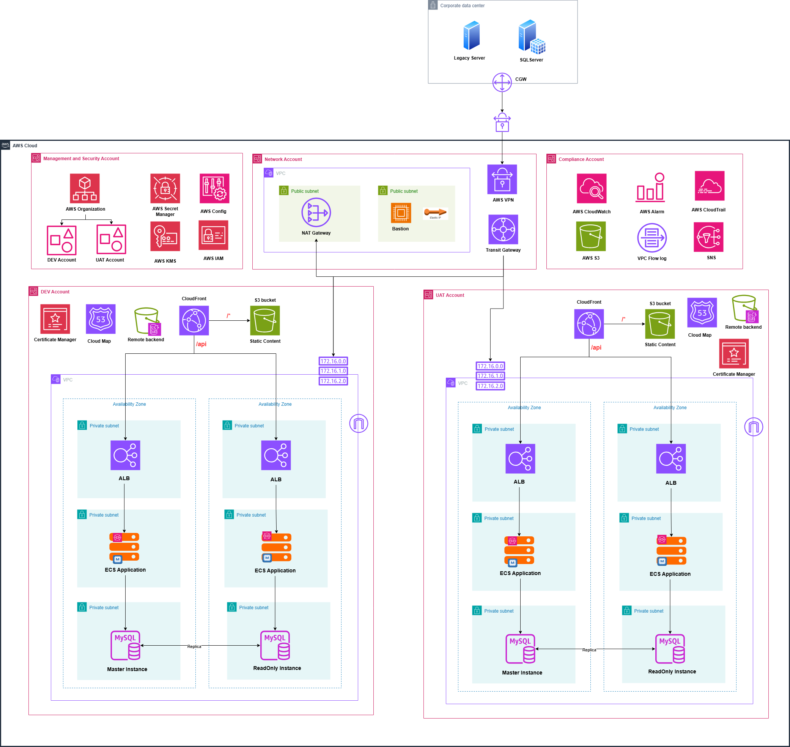
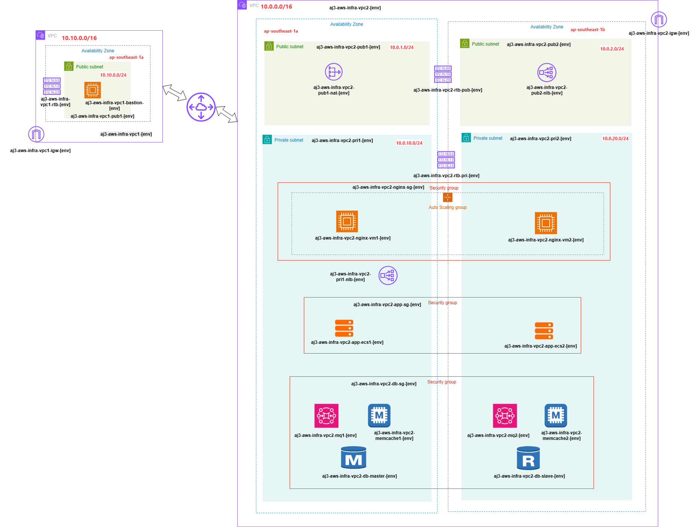

# 📘 [AJ3] DevOps Project Documentation

## I. Project Overview

- Project Name: End to End AWS DevOps Infrastructure

- Objective: Automate the build, deployment, and infrastructure provisioning of a Java-based 3-tier web application using CI/CD pipelines and Infrastructure as Code (IaC).

- Key values:
    - Built modular Terraform infrastructure for DEV/UAT/DR, enabling version-controlled, repeatable deployments. Optimized provisioning, reduced manual effort, improved consistency, and ensured high availability across AZs with autoscaling, NAT, ECS, and ALBs.
    - Implemented CI/CD pipeline via GitHub Actions, deploying Java microservices to ECS Fargate with JFrog Artifactory and version tagging, enhancing deployment speed, ensuring release traceability, minimizing human error, and improving delivery consistency across environments.
    - Enhanced infrastructure security by enforcing IAM and security groups via Terraform, minimizing exposure through strict private/public segmentation, detecting code and dependency vulnerabilities with SonarQube and JFrog Xray to reduce attack surface and ensure compliance.
    - Enabled high availability and disaster recovery by configuring multi-AZ RDS (MySQL) with automated backups, cross-region snapshot replication, and structured DR playbooks to meet SLA uptime target of 99.95%.
    - Enforced centralized monitoring and alerting using AWS CloudWatch Alarms, AWS CloudTrail, and VPC Flow Logs to track resource health, container behavior, and suspicious activity—enhancing observability and response readiness across all environments.

- Tech Stack: GitHub Actions, Terraform, Docker, ECS, ECR, SonarCloud, JFrog, RDS (MySQL), Amazon MQ, ElastiCache (Memcached), CloudWatch, CloudFront, ALB, Nginx, Tomcat, Maven.


- AWS Landing Zone



- Architecture Diagram: (AWS-JAVA-3TIER)

.svg>)

## II. High-Level Architecture

### 🌐 AWS Account Structuring Overview:

```
AWS Organizations
│
├── Root Account
│
├── OU: Sandbox / Dev
│   └── AWS Account: dev-account
│
├── OU: Non-Prod
│   └── AWS Account: uat-account

```

- Dev Account: dùng bởi developers, ít hạn chế (nhưng vẫn theo IAM, guardrails)
- UAT Account: kiểm thử trước khi lên Prod, tách biệt hoàn toàn khỏi Dev


```
terraform-aws/
├── envs/
│   ├── dev/
│   │   ├── main.tf
│   │   ├── variables.tf
│   │   ├── backend.tf (S3 bucket: dev-tf-state)
│   │   └── provider.tf (assume role to dev AWS account)
│   └── uat/
│       ├── main.tf
│       ├── variables.tf
│       ├── backend.tf (bucket: uat-tf-state)
│       └── provider.tf (assume role to uat AWS account)
├── modules/
│   ├── network-vpc/
│   └── ecs/
```

### 🌐 Backend State per environment:

envs/dev/backend.tf:

```
terraform {
  backend "s3" {
    bucket         = "dev-tf-state"
    key            = "vpc/main.tfstate"
    region         = "ap-southeast-1"
    dynamodb_table = "dev-tf-lock"
    encrypt        = true
  }
}

```

envs/uat/backend.tf:

```
terraform {
  backend "s3" {
    bucket         = "uat-tf-state"
    key            = "vpc/main.tfstate"
    region         = "ap-southeast-1"
    dynamodb_table = "uat-tf-lock"
    encrypt        = true
  }
}

```

### 🔁 Full Terraform Workflow Step-by-Step

- Developer tạo feature branch feature/add-s3-bucket
- Viết code trong module và folder envs/dev
- Push lên GitHub -> mở Pull Request vào branch dev
- CI Pipeline chạy:
  - terraform init -backend-config=... (dev)
  - terraform plan
  - Upload terraform plan output vào PR comment (CI/CD)

    ```
    - name: Terraform Plan
      id: plan
      run: |
        terraform plan -input=false -no-color > tfplan.txt

    - name: Upload Plan to PR Comment
      uses: juliangruber/terraform-plan-commenter@v1.2.0
      with:
        plan: tfplan.txt
        github_token: ${{ secrets.GITHUB_TOKEN }}
    ```

- Reviewer approve → Merge vào branch dev
- CI của branch dev chạy terraform apply TỰ ĐỘNG lên môi trường DEV
- Khi DEV stable → tạo PR từ dev → main
- CI chạy plan cho môi trường UAT (envs/uat)
- Approve & merge → CI branch main chạy terraform apply lên UAT


### 🔄 Blue-Green Deployment Flow (ECS + Jenkins + Terraform)

#### 1. Tag & Build:

Tag source code with a version (e.g., v1.0.0).

Jenkins Build Job builds Docker image and pushes image to ECR with that version tag.

#### 2. Deploy New Version (Terraform):

Update Terraform variables to use the new ECR image version.

Terraform deploys ECS tasks to both green and blue clusters via separate target groups attached to the same ALB.

Application is reachable on two different ALB listeners (e.g., port 80 → blue, port 81 → green).

#### 3. Deploy via Jenkins Job 2 (ECS Deploy):

Jenkins deploy job triggers ECS service update to either blue or green cluster (e.g., deploy new version to green).

Validate new version through separate ALB listener before switching traffic.

#### 4. Switch Traffic:

Jenkins Switch Traffic Job updates ALB listener rules/weights to direct production traffic from blue target group to green.

Zero downtime cutover once verification is complete.

#### 5. Cleanup:

Remove old tasks / cluster (blue or green) via Jenkins Clear Resource Job to free up resources and keep only the active environment.


### 🌐 Full Flow Overview:


```
User (Internet)
    ↓
CloudFront CDN (HTTPS, custom domain + caching)
    ↓
S3 Static Website (Frontend React / FE assets)
    ↓
Application Requests
    ↓
ALB (HTTP/HTTPS – public, gateway API routing)
    ↓
ECS Service (Backend API in private subnet)
    ↓
RDS (private DB subnet, port 3306)

```

### 🌐 CloudFront + S3 + ALB:


```
User
  ↓
CloudFront
  ├── "/"               → S3 static frontend (with OAC / bucket policy restrict to CF)
  └── "/api/*"          → ALB (my-alb-1234567890.ap-southeast-1.elb.amazonaws.com)
                          ├── /api/rdm   → ECS Service rdm
                          ├── /api/aegis → ECS Service aegis
                          └── /api/moai  → ECS Service moai

```


#### 🧱 Architecture:

FE (React/Vue/NextJS build files) được build và upload lên S3.

CloudFront sử dụng Origin Access Control (OAC) để truy cập S3.

S3 bucket policy chỉ cho phép access từ CloudFront OAC, deny public.

⚙ Terraform Module (ví dụ tf/modules/s3_fe):
module "frontend_bucket" {
  source       = "./modules/s3_fe"
  bucket_name  = var.bucket_name
  oac_enabled  = true 
}

#### 🧱 CI/CD (GitHub Actions) cho FE:

Sau khi npm run build, chạy aws s3 sync build/ s3://my-fe-bucket

Gắn invalidation CloudFront nếu cần

```
# .github/workflows/deploy-fe.yaml
jobs:
  deploy_fe:
    runs-on: ubuntu-latest
    steps:
      - uses: actions/checkout@v3
      - run: npm ci && npm run build
      - uses: aws-actions/configure-aws-credentials@v2
        with:
          aws-access-key-id: ${{ secrets.AWS_ACCESS_KEY_ID }}
          aws-secret-access-key: ${{ secrets.AWS_SECRET_ACCESS_KEY }}
          aws-region: ap-southeast-1
      - run: aws s3 sync ./build s3://${{ secrets.S3_BUCKET_NAME }}/
      - run: aws cloudfront create-invalidation --distribution-id <CF_ID> --paths "/*"

```


#### 🧱 API – ALB → ECS microservices (multi services)

- 1 public ALB + listener 80/443
- Path-based routing
  - /api/rdm → target group RDM → ECS Fargate Task rdm
  - /api/aegis → target group Aegis
  - /api/moai → target group Moai

- Mỗi ECS Service chạy trong private subnet, dùng riêng security group + IAM Task Role.

```
User
  ↳ ALB
      - Port 80:
         /rdm   -> target_group rdm_blue
         /aegis -> target_group aegis_blue
      - Port 81:
         /rdm   -> target_group rdm_green
         /aegis -> target_group aegis_green


```

- Mỗi ECS Service gồm 2 thực thể: rdm-blue, rdm-green, aegis-blue, aegis-green.


```
###############################
# Variables (giả sử đã define bên ngoài)
###############################
variable "cluster_name" {}
variable "task_execution_role_arn" {}
variable "task_role_arn" {}
variable "image_tag_rdm" {}
variable "image_tag_aegis" {}
variable "vpc_id" {}
variable "subnets" { type = list(string) }
variable "ecs_security_groups" { type = list(string) }

###############################
# ALB
###############################
resource "aws_lb" "app_alb" {
  name               = "api-alb"
  load_balancer_type = "application"
  subnets            = var.subnets
  security_groups    = var.ecs_security_groups
}

# Listener 80 = BLUE
resource "aws_lb_listener" "listener_blue" {
  load_balancer_arn = aws_lb.app_alb.arn
  port              = "80"
  protocol          = "HTTP"

  default_action {
    type             = "fixed-response"
    fixed_response {
      content_type = "text/plain"
      message_body = "Default ALB Response"
      status_code  = "200"
    }
  }
}

# Listener 81 = GREEN
resource "aws_lb_listener" "listener_green" {
  load_balancer_arn = aws_lb.app_alb.arn
  port              = "81"
  protocol          = "HTTP"
  default_action {
    type             = "fixed-response"
    fixed_response {
      content_type = "text/plain"
      message_body = "Green Default"
      status_code  = "200"
    }
  }
}

###############################
# Target Groups (Blue & Green for rdm + aegis)
###############################
resource "aws_lb_target_group" "rdm_blue_tg" {
  name     = "tg-rdm-blue"
  port     = 8080
  protocol = "HTTP"
  vpc_id   = var.vpc_id
  target_type = "ip"
}

resource "aws_lb_target_group" "rdm_green_tg" {
  name     = "tg-rdm-green"
  port     = 8080
  protocol = "HTTP"
  vpc_id   = var.vpc_id
  target_type = "ip"
}

resource "aws_lb_target_group" "aegis_blue_tg" {
  name     = "tg-aegis-blue"
  port     = 8080
  protocol = "HTTP"
  vpc_id   = var.vpc_id
  target_type = "ip"
}

resource "aws_lb_target_group" "aegis_green_tg" {
  name     = "tg-aegis-green"
  port     = 8080
  protocol = "HTTP"
  vpc_id   = var.vpc_id
  target_type = "ip"
}

###############################
# Listener Rules
###############################
# BLUE listener rules
resource "aws_lb_listener_rule" "rdm_rule_blue" {
  listener_arn = aws_lb_listener.listener_blue.arn
  priority     = 10
  action {
    type             = "forward"
    target_group_arn = aws_lb_target_group.rdm_blue_tg.arn
  }
  condition {
    path_pattern { values = ["/rdm*"] }
  }
}

resource "aws_lb_listener_rule" "aegis_rule_blue" {
  listener_arn = aws_lb_listener.listener_blue.arn
  priority     = 20
  action {
    type             = "forward"
    target_group_arn = aws_lb_target_group.aegis_blue_tg.arn
  }
  condition {
    path_pattern { values = ["/aegis*"] }
  }
}

# GREEN listener rules
resource "aws_lb_listener_rule" "rdm_rule_green" {
  listener_arn = aws_lb_listener.listener_green.arn
  priority     = 10
  action {
    type             = "forward"
    target_group_arn = aws_lb_target_group.rdm_green_tg.arn
  }
  condition {
    path_pattern { values = ["/rdm*"] }
  }
}

resource "aws_lb_listener_rule" "aegis_rule_green" {
  listener_arn = aws_lb_listener.listener_green.arn
  priority     = 20
  action {
    type             = "forward"
    target_group_arn = aws_lb_target_group.aegis_green_tg.arn
  }
  condition {
    path_pattern { values = ["/aegis*"] }
  }
}

###############################
# Task Definitions
###############################
resource "aws_ecs_task_definition" "rdm_task" {
  family                   = "rdm"
  network_mode             = "awsvpc"
  requires_compatibilities = ["FARGATE"]
  cpu                      = "256"
  memory                   = "512"
  execution_role_arn       = var.task_execution_role_arn
  task_role_arn            = var.task_role_arn

  container_definitions = jsonencode([{
    name  = "rdm"
    image = "430950558682.dkr.ecr.ap-southeast-1.amazonaws.com/rdm:${var.image_tag_rdm}"
    portMappings = [{ containerPort = 8080 }]
    essential = true
  }])
}

resource "aws_ecs_task_definition" "aegis_task" {
  family                   = "aegis"
  network_mode             = "awsvpc"
  requires_compatibilities = ["FARGATE"]
  cpu                      = "256"
  memory                   = "512"
  execution_role_arn       = var.task_execution_role_arn
  task_role_arn            = var.task_role_arn

  container_definitions = jsonencode([{
    name  = "aegis"
    image = "430950558682.dkr.ecr.ap-southeast-1.amazonaws.com/aegis:${var.image_tag_aegis}"
    portMappings = [{ containerPort = 8080 }]
    essential = true
  }])
}

###############################
# ECS Services (Blue & Green) for both Services
###############################
# RDM Services
resource "aws_ecs_service" "rdm_blue_service" {
  name            = "rdm-blue"
  cluster         = var.cluster_name
  task_definition = aws_ecs_task_definition.rdm_task.arn
  desired_count   = 1
  launch_type     = "FARGATE"
  network_configuration {
    subnets         = var.subnets
    security_groups = var.ecs_security_groups
    assign_public_ip = false
  }
  load_balancer {
    target_group_arn = aws_lb_target_group.rdm_blue_tg.arn
    container_name   = "rdm"
    container_port   = 8080
  }
}

resource "aws_ecs_service" "rdm_green_service" {
  name            = "rdm-green"
  cluster         = var.cluster_name
  task_definition = aws_ecs_task_definition.rdm_task.arn
  desired_count   = 0
  launch_type     = "FARGATE"
  network_configuration {
    subnets         = var.subnets
    security_groups = var.ecs_security_groups
    assign_public_ip = false
  }
  load_balancer {
    target_group_arn = aws_lb_target_group.rdm_green_tg.arn
    container_name   = "rdm"
    container_port   = 8080
  }
}

# AEGIS Services
resource "aws_ecs_service" "aegis_blue_service" {
  name            = "aegis-blue"
  cluster         = var.cluster_name
  task_definition = aws_ecs_task_definition.aegis_task.arn
  desired_count   = 1
  launch_type     = "FARGATE"
  network_configuration {
    subnets         = var.subnets
    security_groups = var.ecs_security_groups
    assign_public_ip = false
  }
  load_balancer {
    target_group_arn = aws_lb_target_group.aegis_blue_tg.arn
    container_name   = "aegis"
    container_port   = 8080
  }
}

resource "aws_ecs_service" "aegis_green_service" {
  name            = "aegis-green"
  cluster         = var.cluster_name
  task_definition = aws_ecs_task_definition.aegis_task.arn
  desired_count   = 0
  launch_type     = "FARGATE"
  network_configuration {
    subnets         = var.subnets
    security_groups = var.ecs_security_groups
    assign_public_ip = false
  }
  load_balancer {
    target_group_arn = aws_lb_target_group.aegis_green_tg.arn
    container_name   = "aegis"
    container_port   = 8080
  }
}


```


#### 🧱 Blue-Green per Microservice – Architectural Upgrade

- Nếu muốn blue-green deployment riêng từng service:

- Option: Weighted Target Groups

- Cho mỗi ECS service, ta tạo 2 target group: rdm-blue, rdm-green

- CI/CD deploy image vào ECS green task → test

- Sau test xong, dùng aws_lb_listener_rule để switch weight:
  - 100% traffic → blue
  - 0% → green (initial)

- Sau khi verify: switch 100% → green

- Terraform Cho Blue-Green ECS Service

```
resource "aws_lb_target_group" "rdm_blue" { ... }
resource "aws_lb_target_group" "rdm_green" { ... }
# ECS service rdm-blue, service rdm-green (desired count = 1 or 0)
# Listener Rule Weight:
resource "aws_lb_listener" "rdm_rule" {
   default_action {
      type             = "forward"
      forward {
         target_group {
           arn   = aws_lb_target_group.rdm_blue.arn
           weight = var.weight_blue
         }
         target_group {
           arn   = aws_lb_target_group.rdm_green.arn
           weight = var.weight_green
         }
      }
   }
}

```


#### 🌐  PHẦN 1 — Cấu trúc 2 GitHub Actions riêng
.github/workflows/
  ├── cicd-rdm.yml
  └── cicd-aegis.yml

#### 🌐  PHẦN 2 — Ví dụ GitHub Action cho rdm (kèm Blue/Green)

```
# .github/workflows/cicd-rdm.yml
name: RDM CICD

on:
  push:
    branches: [ main ]
    paths: ["rdm/**"]        # chỉ build khi folder rdm có thay đổi

jobs:
  build-and-deploy:
    runs-on: ubuntu-latest

    steps:
    - name: Checkout code
      uses: actions/checkout@v4

    - name: Build Docker image
      run: |
        docker build -t ${{ secrets.AWS_ACCOUNT_ID }}.dkr.ecr.ap-southeast-1.amazonaws.com/rdm:${{ github.sha }} ./rdm

    - name: Login to Amazon ECR
      uses: aws-actions/amazon-ecr-login@v2

    - name: Push Docker image
      run: |
        docker push ${{ secrets.AWS_ACCOUNT_ID }}.dkr.ecr.ap-southeast-1.amazonaws.com/rdm:${{ github.sha }}

    - name: Blue/Green Deploy (Green == port 81)
      run: |
        # 1) Update ECS service task definition to use new image, deploy to GREEN TG
        aws ecs update-service \
          --cluster rdm-cluster \
          --service rdm-green-svc \
          --task-definition rdm-task:${{ github.sha }}

        # 2) Wait until service stable
        aws ecs wait services-stable \
          --cluster rdm-cluster \
          --services rdm-green-svc

        echo "Green deployed to port 81: now manual or auto test..."

    - name: Swap Traffic if test OK
      if: ${{ github.event.inputs.swap == 'true' }}
      run: |
        # 3) Swap listener rules on ALB: port 80 => Green TG
        aws elbv2 modify-listener \
          --listener-arn arn:aws:elasticloadbalancing:...YOUR-LISTENER-ARN \
          --default-actions Type=forward,TargetGroupArn=arn:aws:elasticloadbalancing:...GREEN-TG-ARN

        # 4) Scale down Blue service to zero
        aws ecs update-service \
          --cluster rdm-cluster \
          --service rdm-blue-svc \
          --desired-count 0

```

- Giải thích logic:
  - Luôn deploy image mới vào service “green” (port 81).
  - Kiểm thử xong nếu OK, chạy step Swap Traffic để modify listener và scale service blue về 0.


#### 🧱 CI/CD GitHub Actions cho Backend (ECS):

```
name: Deploy Backend

on:
  push:
    tags:
      - 'v*'   # v1.0.0, v1.0.1

jobs:
  build-and-push:
    ...
    - run: docker build -t $ECR_REPO:$GITHUB_REF_NAME .
    - run: docker push $ECR_REPO:$GITHUB_REF_NAME

  deploy:
    needs: build-and-push
    steps:
      - uses: actions/checkout@v3
      - uses: aws-actions/configure-aws-credentials@v2
      - run: aws ecs update-service --cluster rdm-green --service rdm-green --force-new-deployment
      # hoặc dùng Terraform apply -var image_tag=${{ github.ref_name }}

```


### 🌐 CloudWatch + CloudTrail + CloudConfig Rules

### 🔐 Secrets Manager rotation policies
   
#### 1️⃣ Tạo Secret trong Secrets Manager với Lambda rotation

```
# Secret lưu DB password
resource "aws_secretsmanager_secret" "mysql_secret" {
  name = "mysql-db-password"
  description = "MySQL root password for RDM"
  rotation_lambda_arn = aws_lambda_function.rotate_mysql_secret.arn

  rotation_rules {
    automatically_after_days = 30
  }
}

resource "aws_secretsmanager_secret_version" "mysql_secret_value" {
  secret_id     = aws_secretsmanager_secret.mysql_secret.id
  secret_string = jsonencode({
    username = "admin"
    password = "InitialPassword123"
    host     = "mydb.cluster.amazonaws.com"
  })
}

# Lambda role
resource "aws_iam_role" "lambda_rotation_role" {
  name = "rotation-lambda-role"
  assume_role_policy = jsonencode({
    Version = "2012-10-17",
    Statement = [{
      Action = "sts:AssumeRole",
      Effect = "Allow",
      Principal = { Service = "lambda.amazonaws.com" }
    }]
  })
}

resource "aws_iam_role_policy_attachment" "lambda_rotation_basic" {
  role       = aws_iam_role.lambda_rotation_role.name
  policy_arn = "arn:aws:iam::aws:policy/service-role/AWSLambdaBasicExecutionRole"
}

# Lambda rotation function (ví dụ MySQL rotation template)
resource "aws_lambda_function" "rotate_mysql_secret" {
  filename         = "lambda_rotation_mysql.zip"  # zip chứa code rotation
  function_name    = "RotateMysqlSecret"
  handler          = "index.handler"
  runtime          = "python3.11"
  role             = aws_iam_role.lambda_rotation_role.arn
  timeout          = 60
}

```

🔹 Lưu ý: lambda_rotation_mysql.zip là AWS cung cấp template rotation function cho MySQL.
#### 2️⃣ ECS Task Role cho truy cập secret

```
resource "aws_iam_role" "ecs_task_role" {
  name = "rdm-task-role"
  assume_role_policy = jsonencode({
    Version = "2012-10-17",
    Statement = [{
      Action = "sts:AssumeRole",
      Effect = "Allow",
      Principal = { Service = "ecs-tasks.amazonaws.com" }
    }]
  })
}

resource "aws_iam_role_policy" "ecs_task_secret_policy" {
  name = "ecs-task-secret-policy"
  role = aws_iam_role.ecs_task_role.id

  policy = jsonencode({
    Version = "2012-10-17",
    Statement = [{
      Effect = "Allow",
      Action = ["secretsmanager:GetSecretValue"],
      Resource = aws_secretsmanager_secret.mysql_secret.arn
    }]
  })
}

```

#### 3️⃣ ECS Task Definition với Secret

```
resource "aws_ecs_task_definition" "rdm_task" {
  family                   = "rdm-task"
  network_mode             = "awsvpc"
  requires_compatibilities = ["FARGATE"]
  cpu                      = "512"
  memory                   = "1024"
  execution_role_arn       = aws_iam_role.ecs_task_role.arn
  task_role_arn            = aws_iam_role.ecs_task_role.arn

  container_definitions = jsonencode([{
    name      = "rdm-container"
    image     = "123456789012.dkr.ecr.ap-southeast-1.amazonaws.com/rdm:latest"
    essential = true

    environment = [
      {
        name  = "DB_HOST"
        value = "mydb.cluster.amazonaws.com"
      }
    ]

    secrets = [
      {
        name      = "DB_PASSWORD"
        valueFrom = aws_secretsmanager_secret.mysql_secret.arn
      }
    ]

    logConfiguration = {
      logDriver = "awslogs"
      options = {
        awslogs-group         = "/ecs/rdm"
        awslogs-region        = "ap-southeast-1"
        awslogs-stream-prefix = "ecs"
      }
    }
  }])
}

```
🔹 Lưu ý: DB_PASSWORD sẽ lấy trực tiếp từ Secrets Manager, không cần hardcode.
#### 4️⃣ ECS Service
```
resource "aws_ecs_service" "rdm_service" {
  name            = "rdm-service"
  cluster         = aws_ecs_cluster.rdm_cluster.id
  task_definition = aws_ecs_task_definition.rdm_task.arn
  desired_count   = 2
  launch_type     = "FARGATE"
  network_configuration {
    subnets         = ["subnet-xxxxxxx", "subnet-yyyyyyy"]
    security_groups = ["sg-xxxxxxxx"]
    assign_public_ip = true
  }
}
```
#### 5️⃣ Lambda + CloudWatch Event để redeploy ECS khi secret rotate

```
# Lambda role cho redeploy ECS
resource "aws_iam_role" "ecs_redeploy_lambda_role" {
  name = "ecs-redeploy-role"
  assume_role_policy = jsonencode({
    Version = "2012-10-17",
    Statement = [{
      Action = "sts:AssumeRole",
      Effect = "Allow",
      Principal = { Service = "lambda.amazonaws.com" }
    }]
  })
}

resource "aws_iam_role_policy" "ecs_redeploy_lambda_policy" {
  name = "ecs-redeploy-policy"
  role = aws_iam_role.ecs_redeploy_lambda_role.id
  policy = jsonencode({
    Version = "2012-10-17",
    Statement = [
      {
        Effect = "Allow",
        Action = [
          "ecs:UpdateService",
          "ecs:DescribeServices",
          "ecs:DescribeTaskDefinition"
        ],
        Resource = "*"
      }
    ]
  })
}

# Lambda function redeploy ECS service
resource "aws_lambda_function" "ecs_redeploy" {
  filename         = "redeploy_ecs.zip" # zip chứa code Lambda
  function_name    = "ECSRedeployOnSecretRotate"
  handler          = "index.handler"
  runtime          = "python3.11"
  role             = aws_iam_role.ecs_redeploy_lambda_role.arn
  timeout          = 60
}

# CloudWatch Event Rule trigger Lambda khi secret rotated
resource "aws_cloudwatch_event_rule" "secret_rotate_rule" {
  name        = "SecretRotateRule"
  description = "Trigger ECS redeploy when secret rotation happens"
  event_pattern = jsonencode({
    "source": ["aws.secretsmanager"],
    "detail-type": ["AWS API Call via CloudTrail"],
    "detail": {
      "eventName": ["RotateSecret"]
    }
  })
}

resource "aws_cloudwatch_event_target" "secret_rotate_target" {
  rule      = aws_cloudwatch_event_rule.secret_rotate_rule.name
  target_id = "ECSRedeployLambda"
  arn       = aws_lambda_function.ecs_redeploy.arn
}

resource "aws_lambda_permission" "allow_cloudwatch_to_call" {
  statement_id  = "AllowExecutionFromCloudWatch"
  action        = "lambda:InvokeFunction"
  function_name = aws_lambda_function.ecs_redeploy.function_name
  principal     = "events.amazonaws.com"
  source_arn    = aws_cloudwatch_event_rule.secret_rotate_rule.arn
}

```


### 🔐 Security Group Rules Overview

#### 📌 Public NLB Security Group (Public SG)

| **Direction** | **Type** | **Port** | **Source/Destination** | **Purpose**                                      |
|---------------|----------|----------|-------------------------|--------------------------------------------------|
| Inbound       | HTTP     | 80       | 0.0.0.0/0               | Allow traffic from the internet                  |
| Outbound      | HTTP     | 80       | NGINX SG                | Forward request to NGINX reverse proxy           |

---


#### 📌 Private NLB Security Group

| **Direction** | **Type** | **Port** | **Source/Destination** | **Purpose**                                      |
|---------------|----------|----------|-------------------------|--------------------------------------------------|
| Inbound       | HTTP     | 8080     | NGINX SG                | Accept traffic from NGINX                        |
| Outbound      | HTTP     | 8080     | ECS Task SG             | Forward to ECS application container             |

---

#### 📌 ECS Task Security Group

| **Direction** | **Type** | **Port** | **Source/Destination** | **Purpose**                                      |
|---------------|----------|----------|-------------------------|--------------------------------------------------|
| Inbound       | HTTP     | 8080     | Private NLB SG          | Accept traffic from Private NLB                  |
| Outbound      | All      | All      | 0.0.0.0/0               | Allow internet and DB access                     |

---

#### 📌 Private DB Security Group

| **Direction** | **Type**    | **Port** | **Source/Destination** | **Purpose**                                      |
|---------------|-------------|----------|-------------------------|--------------------------------------------------|
| Inbound       | MySQL/Aurora| 3306     | ECS Task SG             | Accept DB queries from ECS task                  |
| Outbound      | All         | All      | 0.0.0.0/0               | Allow system updates, DNS, etc.                  |


## III. High-Level Goals for 99.95% SLA

### Availability & Resilience Strategy

| **Area**              | **Objective**                                                       |
|-----------------------|---------------------------------------------------------------------|
| **High Availability** | Avoid single points of failure (use Multi-AZ & AutoFailover)       |
| **Data Durability**   | Enable automated backups and cross-region replication              |
| **Minimal Downtime**  | Use safe deployment strategies (`create_before_destroy`)           |
| **Disaster Recovery** | Define and test DR runbooks (manual + automated recovery)          |
| **Monitoring & Alerts** | Detect failures fast with alarms and metrics                     |


### Multi-AZ RDS for High Availability

#### ☑️ Terraform Task

- Use multi_az = true in your RDS configuration.
- Choose instance class that supports Multi-AZ (e.g., db.m6g.large or above).

```
resource "aws_db_instance" "primary" {
  identifier         = "app-prod-db"
  engine             = "mysql"
  instance_class     = "db.m6g.large"
  multi_az           = true
  ...
}
```

#### ☑️ Outcome

- Failover to standby in the other AZ within 1–2 minutes.
- AWS manages data replication between AZs.


### Cross-Region Backups

#### ☑️ Terraform Task

- Enable `backup_retention_period` and `copy_tags_to_snapshot`
- Use `aws_db_snapshot` and `aws_db_snapshot_copy` for cross-region copies.

```
resource "aws_db_snapshot_copy" "cross_region" {
  source_db_snapshot_identifier = aws_db_snapshot.primary_snapshot.id
  target_db_snapshot_identifier = "db-copy-${timestamp()}"
  kms_key_id                    = aws_kms_key.replica.arn
  source_region                 = var.primary_region
}
```

#### ☑️ Outcome
- Backups stored securely in another region for DR readiness.

### Safe Deployments with create_before_destroy

#### ☑️ Terraform Task

- Use lifecycle blocks on resources like:
  - Security groups
  - IAM roles
  - Subnets / route tables
  - NLBs
  - EC2 instances

```
resource "aws_security_group" "db_sg" {
  name = "db-sg"

  lifecycle {
    create_before_destroy = true
  }
}

```

#### ☑️ Outcome

- Avoids downtime when updating critical infra like SGs or route tables.

### Disaster Recovery (DR) Playbook

#### ☑️ Manual or Automated Steps

- Document procedures to restore from cross-region snapshot:
  - Launch RDS from snapshot
  - Update DNS or failover route in Route 53
- Terraform module to quickly stand up infrastructure in secondary region

#### ☑️ Automation Tip:
- Use `terraform workspace` or terragrunt to replicate infra to secondary region.


### Monitoring, Alarms, and Failover Automation

- Use CloudWatch Alarms:
  - RDS status checks
  - Freeable memory, CPU, storage thresholds

```
resource "aws_cloudwatch_metric_alarm" "aurora_cpu_high" {
  count               = var.db_mode == "aurora" ? 1 : 0
  alarm_name          = "aurora-cpu-high"
  comparison_operator = "GreaterThanThreshold"
  evaluation_periods  = 3
  metric_name         = "CPUUtilization"
  namespace           = "AWS/RDS"
  period              = 300
  statistic           = "Average"
  threshold           = 80
  alarm_description   = "Alarm when Aurora CPU exceeds 80%"
  dimensions = {
    DBClusterIdentifier = aws_rds_cluster.aurora[0].id
  }
  alarm_actions       = [var.sns_topic_arn]  # Send notifications
}

resource "aws_cloudwatch_metric_alarm" "aurora_replica_lag" {
  count               = var.db_mode == "aurora" ? 1 : 0
  alarm_name          = "aurora-replica-lag-high"
  comparison_operator = "GreaterThanThreshold"
  evaluation_periods  = 3
  metric_name         = "AuroraReplicaLag"
  namespace           = "AWS/RDS"
  period              = 300
  statistic           = "Average"
  threshold           = 60 # seconds
  alarm_description   = "Alarm when Aurora Replica lag exceeds 60 seconds"
  dimensions = {
    DBClusterIdentifier = aws_rds_cluster.aurora[0].id
  }
  alarm_actions       = [var.sns_topic_arn]
}


```

- CloudWatch Metrics for RDS/Aurora

AWS RDS/Aurora automatically sends key performance and health metrics to CloudWatch, including:

| Metric               | Description                      | Why monitor it?                   |
|----------------------|---------------------------------|---------------------------------|
| CPUUtilization       | % of CPU used                   | Detect high load / bottlenecks  |
| FreeableMemory       | Available RAM (bytes)           | Prevent out-of-memory errors    |
| DatabaseConnections  | Number of active DB connections | Avoid connection saturation     |
| FreeStorageSpace     | Free disk space available       | Avoid running out of disk       |
| ReadIOPS / WriteIOPS | I/O operations per second       | Check for unusual or high I/O load |
| ReadLatency / WriteLatency | Time taken for read/write operations | Detect slow queries or storage issues |
| ReplicaLag           | Lag time of replicas (Aurora only) | Ensure replicas are up-to-date |
| DiskQueueDepth       | Number of pending IO requests   | Identify storage bottlenecks    |
| SwapUsage            | Swap space used                 | Can indicate memory pressure    |


- In a real project, how would you apply CloudWatch for RDS/Aurora?
  - Baseline Metrics & Thresholds: Understand your workload baseline (normal CPU, memory, IOPS). Set thresholds slightly above baseline.

  - Create Alarms for Key Metrics: CPU, storage space, connections, replica lag, latency.

  - Setup Notifications: Use SNS to send alerts to DevOps team via email, Slack, PagerDuty.

  - Automated Actions (optional): Use CloudWatch Event Rules + Lambda to automate scale up/down, or perform remediation.

  - Dashboards: Create CloudWatch Dashboards to visualize trends and performance in one place.

  - Logs: Enable enhanced monitoring & export RDS logs (slow query logs, error logs) to CloudWatch Logs for deeper insights.

  - Integrate with CI/CD: Use alarms as gates to halt deployments if DB performance is degraded.


## IV. Module Documentation

### 1. CI/CD Pipeline (GitHub Actions)

🔹 Overview

This pipeline automates build, code scanning, artifact management, image building, security scanning, and deployment to ECS and Nginx.

🔸 Workflow Steps:

Backend (Java):

- Checkout source code from GitHub
- Run SonarCloud scan
- Build with Maven
- Push artifacts to JFrog Artifactory
- Build Docker image
- Scan image with Trivy
- Push to AWS ECR
- Deploy image to ECS

Frontend (Static):

- Checkout frontend code
- Build static files (React/Angular/etc.)
- Copy build output to Nginx EC2 server via SSH or deploy with S3 + CloudFront

#### 📁 GitHub Actions Folder Structure:

```
.github/
  workflows/
    aj3-terraform-ci.yml
    aj3-build-cicd.yml

```

#### Documentation for CICD

[📘 How to setup terraform with Ansible ](https://devopsvn.tech/terraform-series/terraform/bai-13-ansible-with-terraform)

[📘 Dependencies Installation ](docs/AJ3-prequisite-setup.md)

[📘 Github Action CICD Terraform Infra](docs/AJ3-CICD-Infra.md)

[📘 Github Action CICD for Build Docker Image](docs/AJ3-CICD-build.md)


### 2. Terraform Infrastructure Modules

🔹 Overview

All infrastructure is provisioned as modular Terraform code.

🔸 Modules Breakdown

#### 📦 Terraform Module Overview

| Module         | Purpose                                                         |
|----------------|-----------------------------------------------------------------|
| `network`          | Create VPC, public/private subnets, IGW, NAT, and route tables, Transit Gateway  |
| `security`     | Define and attach Security Groups  |
| `bastion`      | Launch EC2 instance in public subnet for SSH access |
| `nginx`        | Deploy EC2 instance for static frontend (Nginx server), install sonarqube server          |
| `database`     | Provision RDS (MySQL) with Multi-AZ, Amazon MQ (e.g., ActiveMQ), Memcached via ElastiCache |
| `autoscaling`  | Set up Auto Scaling Group for application servers               |
| `nlb`          | Configure public/private Network Load Balancers                 |
| `iam`          | Create IAM roles and policies for EC2, ECS, and other services  |
| `ecs`          | Create ECS cluster |


#### 📁 Recommended Structure:

```
terraform/
├── modules/
│   └── network/
│       └── main.tf        
│   └── bastion/
│       └── main.tf        
│   └── ecs/
│       └── main.tf        
│   └── security/
│       └── main.tf        
│   └── database/
│       └── main.tf        
├── envs/
│   ├── dev/
│   │   ├── main.tf
│   │   ├── backend.tf
│   │   └── terraform.tfvars
│   ├── uat/
│   │   ├── backend.tf
│   │   └── terraform.tfvars
│   └── pre-prod/
│       ├── backend.tf
│       └── terraform.tfvars
└── variables.tf           # Common variable definitions

```
#### Terraform design module




#### Create Separate Environments with Workspaces

To use workspaces, eg. DEV environment

```
terraform workspace new dev
terraform workspace select dev
terraform apply -var-file="envs/dev/terraform.tfvars"

```

#### Use Environment-specific Variables

```
env_name       = "dev"
vnet_name      = "dev-vnet"
address_space  = "10.0.0.0/16"
location       = "East US"
resource_group = "rg-dev"

```

#### Use Separate Backends

For state separation across environments, define different backends.

Eg. `envs/dev/backend.tf`

```
terraform {
  backend "s3" {
    bucket         = "my-terraform-state-bucket"   
    key            = "dev/terraform.tfstate"        
    region         = "us-east-1"                    
    dynamodb_table = "terraform-locks"              
    encrypt        = true                           
  }
}

```


### 3. Golden AMI Creation

🔹 Overview

Custom AMIs are created to speed up instance launch and enforce consistency.

🔸 Global Base AMI

Install: AWS CLI, CloudWatch Agent, SSM Agent

🔸 Specialized AMIs:

- Nginx AMI: Install nginx, configure memory metrics
- Tomcat AMI: Install Tomcat, Java 11, systemd setup
- Maven Build AMI: Install Maven, Git, Java 11, preconfigure environment

📌 Optionally use Packer for automation.

### 4. Monitoring & Logging

#### 🔍 Monitoring & Logging

| Tool           | Purpose                                                                 |
|----------------|-------------------------------------------------------------------------|
| `CloudWatch`   | Log and metric collection for EC2, RDS, and application components       |
| `Cronjob + S3` | Push Tomcat logs to S3 and rotate local logs to save disk space         |
| `Alarms`       | Trigger email alerts on threshold breaches (e.g., DB connections > 100) |
| `SNS`          | Send notifications via Email/SMS when alarms are triggered              |


### 5. Application Lifecycle

#### 🔄 Application Lifecycle

| Phase                   | Tasks                                                                 |
|-------------------------|-----------------------------------------------------------------------|
| `Pre-Deployment`        | Build custom AMIs, configure monitoring agents, SonarCloud & JFrog setup |
| `Infrastructure Deployment` | Run Terraform pipelines to provision AWS infrastructure               |
| `CI/CD Execution`       | Build, scan, and deploy applications using GitHub Actions workflows   |
| `Post-Deployment`       | Set up CloudWatch alerts, validate deployment, and configure log rotation |


## VI. Security Best Practices

- Store secrets in GitHub Secrets or AWS Parameter Store
- Use IAM roles, avoid access keys in pipelines
- Principle of Least Privilege (SGs, IAM, S3 access)
- S3 VPC Endpoint instead of public access
- Enable logging: CloudTrail, VPC Flow Logs

